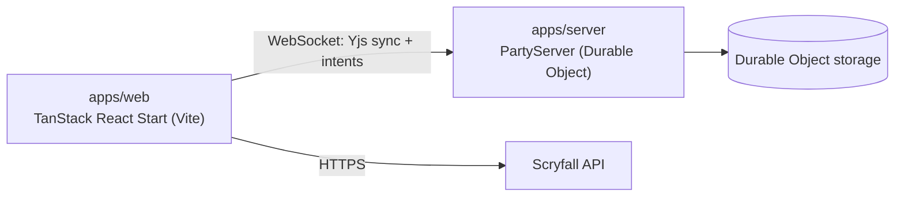

# Drawspell monorepo

## What this repo is

Drawspell (drawspell.space) is a multiplayer tabletop for Magic: The Gathering cards, with realtime shared state and deck import powered by Scryfall card data. The web client renders the board and handles client-side state, while the backend runs a PartyServer/Cloudflare Durable Object that hosts the Yjs document and per-room tokens. Both apps live under `apps/` and communicate over PartyKit/PartyServer WebSockets.

## Architecture at a glance



- Web app (`apps/web`): UI, routing, and client-side state; connects to PartyServer for sync; fetches Scryfall card data.
- Realtime server (`apps/server`): PartyServer runtime; applies intents to the Yjs document; manages hidden state and room tokens in Durable Object storage.
- Shared types: server imports types from `apps/web/src/types` (see `apps/server/src/domain/types.ts`).
- External services: Scryfall API for card metadata; Cloudflare Workers + Durable Objects for hosting.

## Repo structure

| Path          | Description                                                                                                     |
| ------------- | --------------------------------------------------------------------------------------------------------------- |
| `apps/web`    | Web client (TanStack React Start + Vite). See [apps/web/README.md](apps/web/README.md).                         |
| `apps/server` | PartyServer backend (Cloudflare Workers + Durable Objects). See [apps/server/README.md](apps/server/README.md). |

## Getting started

### Prereqs

- Bun `1.2.21` (see `package.json#packageManager`).

### Install

```bash
bun install
```

### Commands (from repo root)

| Task             | Command              | Notes                                          |
| ---------------- | -------------------- | ---------------------------------------------- |
| Dev: web app     | `bun run dev`        | Runs Vite dev server in `apps/web`.            |
| Dev: server      | `bun run dev:server` | Runs `wrangler dev` in `apps/server`.          |
| Build            | `bun run build`      | Builds the web app.                            |
| Preview          | `bun run preview`    | Builds + previews the web app.                 |
| Test             | `bun run test`       | Runs tests for web and server.                 |
| Typecheck        | `bun run typecheck`  | Runs typechecks for web and server.            |
| Cloudflare types | `bun run cf-typegen` | Generates Workers types for the web app.       |
| Lint             | **TBD**              | No `lint` script is defined in `package.json`. |

## Configuration

### Environment variables

| Name                    | Used by    | Description                                        | Source                                             |
| ----------------------- | ---------- | -------------------------------------------------- | -------------------------------------------------- |
| `VITE_WEBSOCKET_SERVER` | `apps/web` | Overrides the PartyServer host (host or full URL). | `apps/web/wrangler.jsonc` or `.env*` in `apps/web` |

### Env files and loading

- Web: Vite loads `.env*` files from `apps/web` if you create them. No `.env` files are checked in.
- Web deploy values live in `apps/web/wrangler.jsonc` under `env`.
- Server: Durable Object binding `rooms` is configured in `apps/server/wrangler.jsonc`.

## Common workflows

### Run the full system locally

1. In one terminal: `bun run dev:server`
2. In another terminal: `bun run dev`
3. Open the URL printed by Vite and create a game.

### Run a single app/package

- Web only: `bun run --cwd apps/web dev`
- Server only: `bun run --cwd apps/server dev`

## Deployment / operations

- Web deploy: `bun run deploy:web` (config: `apps/web/wrangler.jsonc`).
- Server deploy: `bun run deploy:server` (config: `apps/server/wrangler.jsonc`, `apps/server/partykit.json`).
- Durable Object migrations are defined in `apps/server/wrangler.jsonc`.
- CI: **TBD** (no CI config found in the repo; add one under `.github/` or similar).

## Performance

See `docs/performance-report.md` for the latest benchmarks, load scripts, and measurement notes.

## Contributing

- Use Bun for scripts and dependency management.
- Run `bun run test` and `bun run typecheck` before opening a PR.
- Keep changes scoped and update docs/tests when behavior changes.
- Formatting/linting: **TBD** (follow existing file style until a formatter is added).
